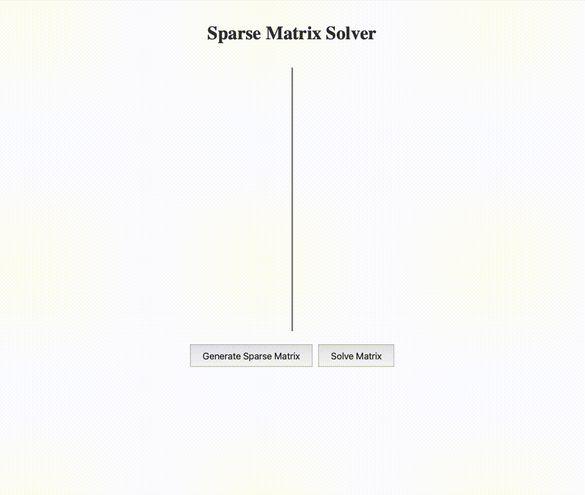

# sparse-matrix-solver

## Objective

UI allows users to:
- generate a sparse matrix 
- solve the sparse matrix. 

## Stack

- frontend == nuxt.js
- backend == rust 

## Demo

## Using this

- download `git clone ... `
- use multiple terminals
    - in the `nuxt-frontend` folder: `npm run dev`
    - in the `rust-backend` folder: `cargo run
- it should be available in browser at `http://localhost:3000`